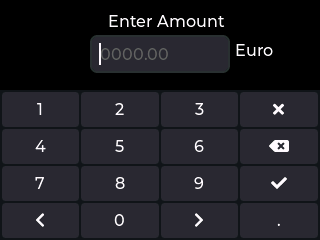

> [!IMPORTANT]
> This program occupies a lot of RAM and it requires additional PSRAM on the CYD (PSRAM Mod).
> 
> The program will most likely crash on the unmodified CYD without addidtional PSRAM.

# LVGL RGB565 Screenshot Export and PNG Converter


This project provides a small set of Python utilities for exporting screenshots from an LVGL display like the CYD with PSRAM Mod or the [JC3248W535 aka Cheap Black Display](https://github.com/de-dh/ESP32-JC3248W535-Micropython-LVGL/tree/main) and converting them into standard PNG images.

The LVGL screenshot is saved as a raw RGB565 buffer together with a metadata file. The converter then reads both files and creates a PNG image.

A Windows drag-and-drop batch file is also included to make the conversion process easier without using the command line manually.



## Overview

The workflow consists of two steps:

1. Capture the active LVGL screen as a raw RGB565 file.
2. Convert the raw RGB565 file into a PNG image on a computer.

Example output files:

```text
screen.raw
screen.raw.txt
screen.png
```

## Files

The files are located in the [`/lvgl9_screenshot`](/lvgl9_screenshot) folder.

### `lvgl9_screenshot.py`

This script captures the currently active LVGL screen and stores it as a raw RGB565 buffer.

It creates two files:

```text
screen.raw
screen.raw.txt
```

The `.raw` file contains the raw pixel data.

The `.txt` file contains the metadata required by the converter.

Example metadata file:

```text
width=320
height=480
cf=RGB565
size=307200
```

### `raw_to_png.py`

This script converts a raw RGB565 screenshot file into a PNG image.

It reads the raw pixel data and the metadata file, converts each RGB565 pixel to 24-bit RGB, and writes the result as a PNG image.

### `raw_to_png_dragdrop.bat`

This Windows batch file provides a simple drag-and-drop interface for the converter.

Instead of opening a terminal and typing the conversion command manually, you can drag a `.raw` file onto the batch file.

The batch file automatically:

- receives the dropped `.raw` file,
- looks for the matching metadata file named `<file.raw>.txt`,
- locates `raw_to_png.py` in the same directory as the batch file,
- runs the converter,
- keeps the terminal window open so that success or error messages can be read.

Example:

```text
screen.raw
screen.raw.txt
raw_to_png.py
raw_to_png_dragdrop.bat
```

Drag `screen.raw` onto `raw_to_png_dragdrop.bat`.

The batch file then runs:

```bat
python raw_to_png.py screen.raw screen.raw.txt
```

The resulting PNG file will be written next to the raw file:

```text
screen.png
```

## Requirements

The PNG converter requires Python 3 and Pillow.

Install Pillow with:

```bash
pip install pillow
```

The screenshot export script requires an LVGL environment with snapshot support enabled.

For the drag-and-drop converter on Windows, Python must be available through the `python` command in the Windows command prompt.

You can test this by running:

```bat
python --version
```

## Capturing a Screenshot from LVGL

Use the following function inside your LVGL Python environment:

```python
def save_screen_raw_to_buf(filename="screen.raw"):
    scr = lv.screen_active()
    w = scr.get_width()
    h = scr.get_height()

    # RGB565 = 2 bytes per pixel
    buf_size = w * h * 2
    buf = bytearray(buf_size)

    img = lv.image_dsc_t()
    res = lv.snapshot_take_to_buf(scr, lv.COLOR_FORMAT.RGB565, img, buf, buf_size)

    if res != lv.RESULT.OK:
        raise RuntimeError("Snapshot failed.")

    with open(filename, "wb") as f:
        f.write(buf)

    with open(filename + ".txt", "w") as f:
        f.write("width={}\n".format(w))
        f.write("height={}\n".format(h))
        f.write("cf=RGB565\n")
        f.write("size={}\n".format(buf_size))


save_screen_raw_to_buf(filename="screen.raw")
```

After running the function, copy both files to your computer:

```text
screen.raw
screen.raw.txt
```

Both files must be kept together because the converter needs the metadata to determine the image width, height, color format, and expected file size.

## Converting the RAW File to PNG from the Command Line

Run the converter with:

```bash
python raw_to_png.py screen.raw
```

By default, the converter expects the metadata file to have the same filename plus `.txt`:

```text
screen.raw.txt
```

The output file will be:

```text
screen.png
```

## Command-Line Usage

```bash
python raw_to_png.py <file.raw> [<file.raw.txt>] [<output.png>]
```

Examples:

```bash
python raw_to_png.py screen.raw
```

```bash
python raw_to_png.py screen.raw screen.raw.txt
```

```bash
python raw_to_png.py screen.raw screen.raw.txt screen.png
```

## Converting the RAW File to PNG by Drag and Drop on Windows

The file `raw_to_png_dragdrop.bat` allows conversion by drag and drop.

### Folder Layout

Place the batch file in the same folder as `raw_to_png.py`:

```text
lvgl9_examples/
├─ raw_to_png.py
├─ raw_to_png_dragdrop.bat
├─ screen.raw
└─ screen.raw.txt
```

### Usage

Drag the raw screenshot file onto the batch file:

```text
Drag screen.raw onto raw_to_png_dragdrop.bat
```

The batch file automatically searches for the metadata file:

```text
screen.raw.txt
```

If the metadata file exists, the batch file starts the Python converter.

If the metadata file is missing, an error message is shown.

### Important Notes

The drag-and-drop converter expects the metadata file to use this naming pattern:

```text
<raw-file-name>.txt
```

For example:

```text
screen.raw
screen.raw.txt
```

The batch file also expects `raw_to_png.py` to be located in the same directory as `raw_to_png_dragdrop.bat`.

## Windows Drag-and-Drop Batch File

Source code of `raw_to_png_dragdrop.bat`:

```bat
@echo off
setlocal

if "%~1"=="" (
    echo Please drag a .raw file onto this batch file.
    echo.
    pause
    exit /b 1
)

set "RAW_FILE=%~1"
set "META_FILE=%RAW_FILE%.txt"
set "SCRIPT_DIR=%~dp0"
set "PY_SCRIPT=%SCRIPT_DIR%raw_to_png.py"

if not exist "%PY_SCRIPT%" (
    echo Python script not found:
    echo %PY_SCRIPT%
    echo.
    pause
    exit /b 1
)

if not exist "%META_FILE%" (
    echo Metadata file not found:
    echo %META_FILE%
    echo.
    echo Expected a file named:
    echo %~nx1.txt
    echo.
    pause
    exit /b 1
)

python "%PY_SCRIPT%" "%RAW_FILE%" "%META_FILE%"

echo.
pause
```

## Metadata Format

The metadata file must contain the following fields:

```text
width=<image width>
height=<image height>
cf=RGB565
size=<raw file size in bytes>
```

Example:

```text
width=320
height=480
cf=RGB565
size=307200
```

The expected raw file size is calculated as:

```text
width * height * 2
```

This is because RGB565 uses 2 bytes per pixel.

## Converter Script

Source code of `raw_to_png.py`:

```python
from PIL import Image
import os
import sys


def read_metadata(meta_file):
    """
    Reads a metadata file in the format
        width=320
        height=480
        cf=RGB565
        size=307200
    and returns a dictionary.
    """
    meta = {}

    with open(meta_file, "r", encoding="utf-8") as f:
        for line in f:
            line = line.strip()
            if not line or "=" not in line:
                continue
            key, value = line.split("=", 1)
            meta[key.strip()] = value.strip()

    return meta


def rgb565_raw_to_png(raw_file, out_file=None, meta_file=None):
    """
    Converts a RAW file in RGB565 format into a PNG image using an associated
    metadata file.

    Expected metadata file by default: <raw_file>.txt

    Example:
        screen.raw
        screen.raw.txt

    Parameters:
        raw_file  : Path to the .raw file
        out_file  : Path to the output PNG file (optional)
        meta_file : Path to the metadata file (optional)
    """
    if meta_file is None:
        meta_file = raw_file + ".txt"

    if out_file is None:
        base, _ = os.path.splitext(raw_file)
        out_file = base + ".png"

    if not os.path.exists(raw_file):
        raise FileNotFoundError(f"RAW file not found: {raw_file}")

    if not os.path.exists(meta_file):
        raise FileNotFoundError(f"Metadata file not found: {meta_file}")

    meta = read_metadata(meta_file)

    try:
        width = int(meta["width"])
        height = int(meta["height"])
        color_format = meta["cf"]
        expected_size = int(meta["size"])
    except KeyError as e:
        raise ValueError(f"Missing metadata entry: {e}")

    if color_format.upper() != "RGB565":
        raise ValueError(
            f"Unsupported color format: {color_format}. "
            "This script currently supports only RGB565."
        )

    with open(raw_file, "rb") as f:
        data = f.read()

    if len(data) != expected_size:
        raise ValueError(
            f"File size does not match the metadata: "
            f"expected {expected_size} bytes, got {len(data)} bytes"
        )

    if len(data) != width * height * 2:
        raise ValueError(
            f"Width/height and size do not match: "
            f"width*height*2 = {width * height * 2}, size = {len(data)}"
        )

    img = Image.new("RGB", (width, height))
    pixels = []

    for i in range(0, len(data), 2):
        pixel = data[i] | (data[i + 1] << 8)

        r = (pixel >> 11) & 0x1F
        g = (pixel >> 5) & 0x3F
        b = pixel & 0x1F

        # Scale to 8 bits per color channel
        r = (r * 255) // 31
        g = (g * 255) // 63
        b = (b * 255) // 31

        pixels.append((r, g, b))

    img.putdata(pixels)
    img.save(out_file)
    return out_file


if __name__ == "__main__":
    if len(sys.argv) < 2:
        print("Usage:")
        print("  python raw_to_png.py <file.raw> [<file.raw.txt>] [<output.png>]")
        print("")
        print("Example:")
        print("  python raw_to_png.py screen.raw")
        print("  python raw_to_png.py screen.raw screen.raw.txt")
        print("  python raw_to_png.py screen.raw screen.raw.txt screen.png")
        sys.exit(1)

    raw_file = sys.argv[1]
    meta_file = sys.argv[2] if len(sys.argv) >= 3 else None
    out_file = sys.argv[3] if len(sys.argv) >= 4 else None

    try:
        out = rgb565_raw_to_png(raw_file, out_file=out_file, meta_file=meta_file)
        print(f"PNG saved: {out}")
    except Exception as e:
        print(f"Error: {e}")
        sys.exit(1)
```

## Error Handling

The converter checks the following conditions:

- The raw file exists.
- The metadata file exists.
- All required metadata fields are present.
- The color format is `RGB565`.
- The raw file size matches the metadata.
- The raw file size matches `width * height * 2`.

If one of these checks fails, the converter exits with an error message.

The drag-and-drop batch file additionally checks:

- whether a `.raw` file was dropped onto the batch file,
- whether `raw_to_png.py` exists in the same directory as the batch file,
- whether the matching metadata file exists.

## Notes

The converter currently supports only RGB565 input data.

The byte order used by the converter is little-endian RGB565:

```python
pixel = data[i] | (data[i + 1] << 8)
```

This matches the common memory layout used by LVGL for RGB565 buffers.

## License

MIT.
```
