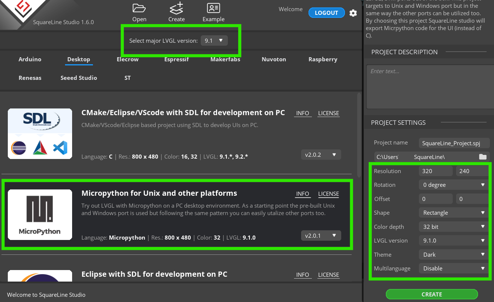
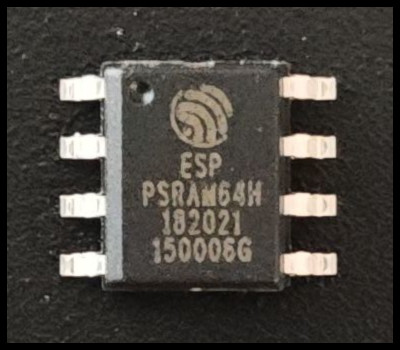
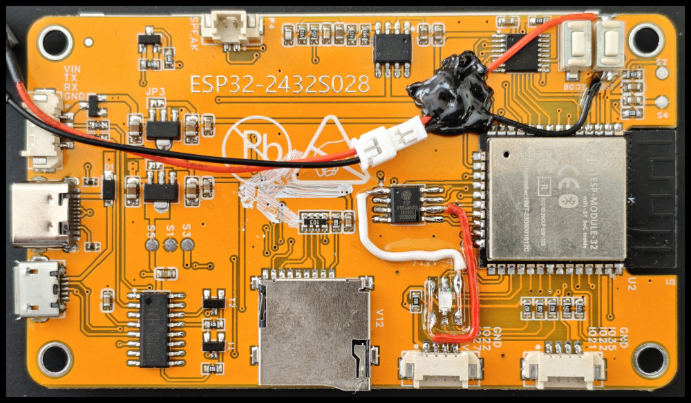
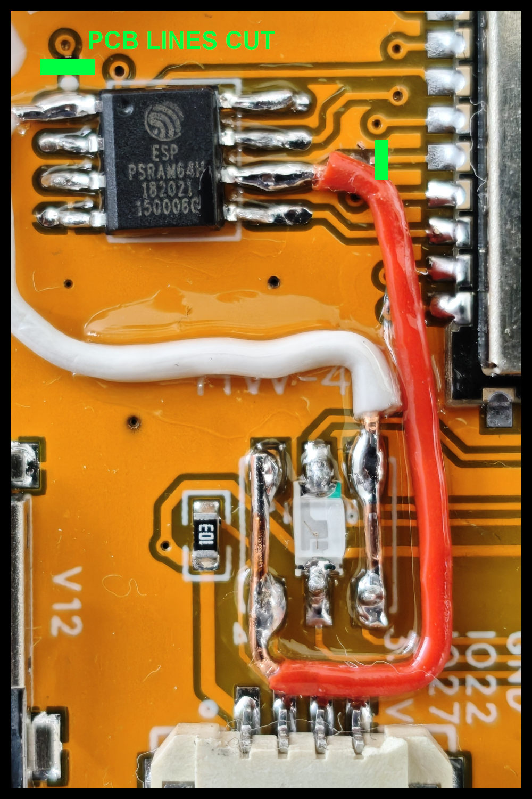

# LVGL9 Setup

## Installing the Precompiled Firmwares

The `/lvgl9_firmwares` folder contains  prebuilt firmwares for the Cheap Yellow Display (CYD) using LVGL 9.4 and MicroPython 1.27.0. 

| File Name  | Description |
| ------------- | ------------- |
| _lvgl9_3_micropython_cyd.bin_  | Previous firmware from this repositry compiled from LVGL 9.3 and MPY 1.25. |
| _lvgl_micropy_ESP32_GENERIC-4.bin_  | Current firmware for the CYD with additional font-sizes of the default montserrat font enabled. Use this version or the __default_ version for the out-of-box CYD.|
| _lvgl_micropy_ESP32_GENERIC-4_default.bin_  | Current firmware for the CYD with only three default font-sizes (12, 14, 16).  |
| _lvgl_micropy_ESP32_GENERIC-SPIRAM-4.bin_  |  Firmware for the CYD with [SPIRAM (PSRAM) Mod](https://github.com/hexeguitar/ESP32_TFT_PIO#adding-psram) and various enabled font-sizes. |
| _lvgl_micropy_ESP32_GENERIC-SPIRAM-4_default.bin_  | Firmware for the CYD with [SPIRAM (PSRAM) Mod](https://github.com/hexeguitar/ESP32_TFT_PIO#adding-psram) and default font-sizes. |
| _touch_color_test.py_  | This file can be used to find the correct display settings after a LVGL9 firmware was installed. See below. |


The firmware was compiled from  [Kdschlosser's Micropython Bindings](https://github.com/lvgl-micropython/lvgl_micropython). All drivers for the CYD are included in the firmware, no additional drivers are needed.

The following command is used to flash the firmware (esptool required):

```bash
python -m esptool --chip esp32 --port COM10 -b 460800 --before default-reset --after hard-reset write-flash --flash-mode dio --flash-size 4MB --flash-freq 40m --erase-all 0x0 lvgl_micropy_ESP32_GENERIC-4_default.bin
```


## Finding the correct display settings

Although the different versions of CYDs all look alike, they require varying parameters for display and touchscreen initialization.
The file `/lvgl9_firmwares/color_test.py` can be used to find the correct display driver's rotation and color settings.
The figure (screenshot from the CYD) below shows how the program should be displayed.
All neccessary settings can be customized at the top of the file. 


```python
# ============== Customize settings ============== #
# The following values need to be customized.

# Switch width and height for portrait mode.
_DISPLAY_WIDTH = const(320)
_DISPLAY_HEIGHT = const(240)
# Try different values from rotation table, see below.
_DISPLAY_ROT = const(0xE0)
# Set to True if red and blue are switched.
_DISPLAY_BGR = const(1)
# May have to be set to 0 if both RGB / BGR mode give bad results.
_DISPLAY_RGB565_BYTE_SWAP = const(1)
# Allow touch calibration. Set to True when display works correctly.
_ALLOW_TOUCH_CAL = const(0)
# Show marker at current touch coordinates.
_DISPLAY_SHOW_TOUCH_INDICATOR = const(1)
```


The following steps have to be followed to correctly set up the CYD for LVGL9. 

A **hard reset is required after every execution of the program** since the hardware might not work correctly otherwise.


1. Depending on the displays orientation the **display's width and height** might need to be edited before running the file. 
For use in landscape mode, `_DISPLAY_WIDTH = 240` and `_DISPLAY_HEIGHT = 320` have to be used. Switch the values for use in portrait mode.
2. Start the program now. If the displayed content is distorted the correct **display rotation** `_DISPLAY_ROT` needs to be found.
The following `MADCTL` values for rotation need to be tested by try and error.

```
# Part from rdagger's micropython ili9341 driver provided under MIT license.
# https://github.com/rdagger/micropython-ili9341/blob/master/ili9341.py

MADCTL_TABLE = {
    (False, 0): 0x80, # mirroring = False
    (False, 90): 0xE0,
    (False, 180): 0x40,
    (False, 270): 0x20,
    (True, 0): 0xC0, # mirroring = True
    (True, 90): 0x60,
    (True, 180): 0x00,
    (True, 270): 0xA0
}
```
3. Next, the correct **colormode** has to be found
E.g. if the red square is rendered in blue then BGR mode must be used by setting `_DISPLAY_BGR = const(1)`. If RGB mode is required set `_DISPLAY_BGR = const(0)`.
4. The last step is the **calibration of the touchscreen**. Set `_ALLOW_TOUCH_CAL = const(1)` and follow the instructions on screen. 
The calibration data is stored in the non volatile storage (NVS) of the Esp32 so calibration has to be performed only once.
The program detects automatically if calibration data is available.

**Potrait Mode Setup**

Switch `_DISPLAY_WIDTH` and `_DISPLAY_HEIGHT` for portrait mode as shown below and determine the correct rotation setting as described above in **Step 2**.

```python
# ============== Customize settings ============== #
# The following values need to be customized.

# Switch width and height for portrait mode.
_DISPLAY_WIDTH = const(240)
_DISPLAY_HEIGHT = const(320)
# Try different values from rotation table.
_DISPLAY_ROT = const(0x0)
```


## Using the Example Programs

Open the file `/lvgl9_examples/lib/lv_config.py` and copy the correct display settings from `/lvgl9_firmwares/color_test.py` to it.
Upload the `/lvgl9_examples` folder to your board and run the example programms. 
You don't need to upload the `/lvgl9_examples/example_screenshots` folder since the screenshots are only used in the documentation.

## Using SquareLine Studio for GUI Design

_SquareLine Studio 1.6.0_ can be used to create screens and some widgets easily.
The required settings are shown in the screenshot below.

Click _Export --> Export UI Files_ in the top menu of SL Studio to export the *.py source files.

A file named `ui.py` will be created in the export directory which contains the UI code.

A lot of the included functions are usually unused so you can just copy the UI part into your own programs.



## Adding PSRAM

An external PSRAM chip can be attached to the CYD as described here: [SPIRAM (PSRAM) Mod](https://github.com/hexeguitar/ESP32_TFT_PIO#adding-psram)
This may be beneficial for LVGL GUI programs with multiple complex screens.

The 4 MB PSRAM chips can be purchased via ALiExpress (10 pcs for ~ 15€).

Desoldering tweezers are or a hot air gun can be used to remove the SMD LED prior to attaching the PSRAM.
I also put some flux on the soldering joints before desoldering. 
I used a fine soldering iron tip and some additional flux to solder the PSRAM chip and the additional SMD LED + the wires.

Be careful to not overheat the PCB since this can cause visible distortion of the TFT screen
The following figures show a single PSRAM chip and the backside of the CYD with attached PSRAM and a single SMD LED.

One of the [SPIRAM-enabled firmwares](#installing-the-precompiled-firmwares) must be used to utilize the PSRAM.
Run 
```python
import gc

print(gc.mem_free())
```
to verify PSRAM. It should output a value of ~ 4 MB.




