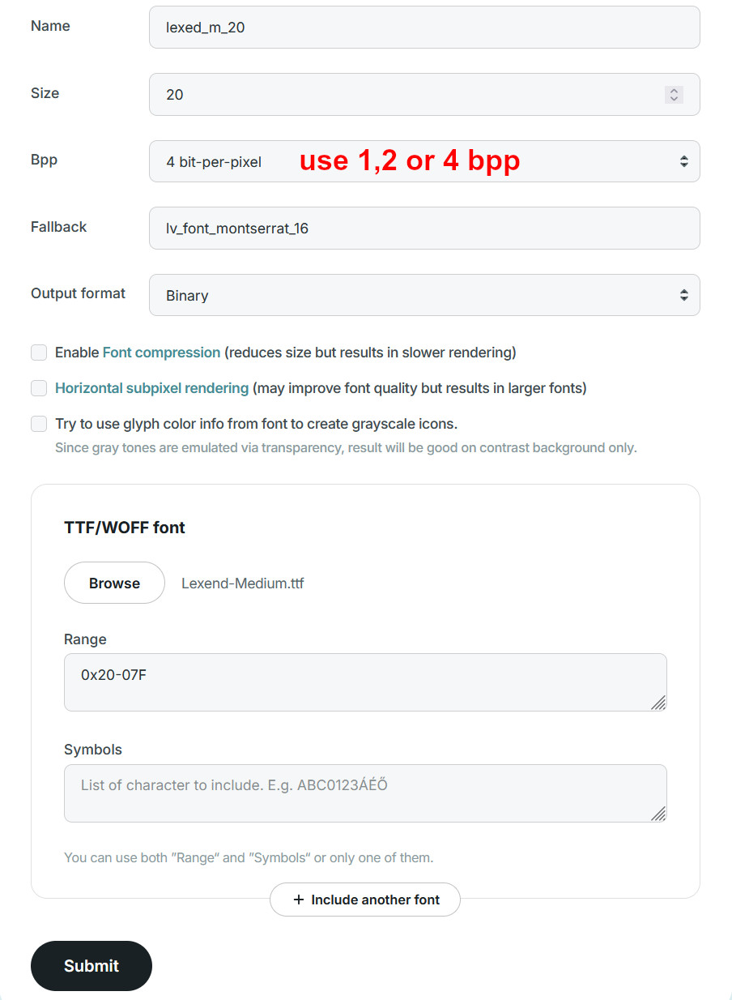

# LVGL Tips

## Examples from the LVGL 8.3 Documentation

The [Documentation for LVGL 8.3](https://docs.lvgl.io/8.3/examples.html) contains Micropython examples for most widgets which are missing in other versions of the documentation.
Most examples can be used with LVGL9 with small modifications.

## LVGL9 Commands

Some commands changed during the upgrade from LVGL8 to LVGL9. E. g., `lv.btn()` becomes `lv.button()`.
The `dir()` method can be used to inspect the attributes of the `lv` class, `lv.obj` class, widget classes etc. to find correct commands.
To inspect the `lv.obj` class and print it's attributes to the shell, the following command can be used:

```python
print(', '.join([m for m in dir(lv.obj) if not m.startswith('__')]))
```

The list can be copied to a text program and commands can be found using search function.

<details>
<summary> 
    Attributes of `lv` 
</summary>

```python
  list, map, pow, ALIGN, ANIM_IMAGE_PART, ANIM_PLAYTIME_INFINITE, ANIM_REPEAT_INFINITE, BASE_DIR, BLEND_MODE, BORDER_SIDE, BUTTONMATRIX_BUTTON_NONE, CHART_POINT_NONE, COLOR_DEPTH, COLOR_FORMAT, COORD, COVER_RES, C_Pointer, DIR, DISPLAY_RENDER_MODE, DISPLAY_ROTATION, DPI_DEF, DRAW_BUF_ALIGN, DRAW_BUF_STRIDE_ALIGN, DRAW_TASK_STATE, DRAW_TASK_TYPE, DROPDOWN_POS_LAST, EVENT, FLEX_ALIGN, FLEX_FLOW, FONT_FMT_TXT, FONT_FMT_TXT_CMAP, FONT_GLYPH_FORMAT, FONT_KERNING, FONT_SUBPX, FS_MODE, FS_RES, FS_SEEK, GRAD_DIR, GRAD_EXTEND, GRIDNAV_CTRL, GRID_ALIGN, GRID_CONTENT, GRID_TEMPLATE_LAST, GROUP_REFOCUS_POLICY, IMAGE_HEADER_MAGIC, INDEV_GESTURE, INDEV_MODE, INDEV_STATE, INDEV_TYPE, KEY, LABEL_DOT_NUM, LABEL_POS_LAST, LABEL_TEXT_SELECTION_OFF, LAYER_TYPE, LAYOUT, LOG_LEVEL, LvReferenceError, OPA, PALETTE, PART, PART_TEXTAREA_PLACEHOLDER, RADIUS_CIRCLE, RB_COLOR, RESULT, SCALE_LABEL_ENABLED_DEFAULT, SCALE_LABEL_ROTATE_KEEP_UPRIGHT, SCALE_LABEL_ROTATE_MATCH_TICKS, SCALE_MAJOR_TICK_EVERY_DEFAULT, SCALE_NONE, SCALE_ROTATION_ANGLE_MASK, SCALE_TOTAL_TICK_COUNT_DEFAULT, SCREEN_LOAD_ANIM, SCROLLBAR_MODE, SCROLL_SNAP, SIZE_CONTENT, SPAN_MODE, SPAN_OVERFLOW, STATE, STRIDE_AUTO, STR_SYMBOL, STYLE, STYLE_RES, STYLE_STATE_CMP, SUBJECT_TYPE, SYMBOL, TABLE_CELL_NONE, TEXTAREA_CURSOR_LAST, TEXT_ALIGN, TEXT_DECOR, TEXT_FLAG, TREE_WALK, _lv_mp_int_wrapper, _nesting, anim_bezier3_para_t, anim_count_running, anim_delete, anim_delete_all, anim_get, anim_get_timer, anim_parameter_t, anim_refr_now, anim_resolve_speed, anim_speed, anim_speed_clamped, anim_speed_to_time, anim_t, anim_timeline_create, anim_timeline_t, animimg, animimg_class, arc, arc_class, arclabel, arclabel_class, area_t, array_t, async_call, async_call_cancel, atan2, bar, bar_class, barcode, barcode_class, bezier3, bidi_calculate_align, bin_decoder_close, bin_decoder_get_area, bin_decoder_info, bin_decoder_init, bin_decoder_open, binfont_create, binfont_destroy, binfont_font_class, bmp_deinit, bmp_init, builtin_font_class, button, button_class, buttonmatrix, buttonmatrix_class, cache_entry_t, calendar, calendar_class, calendar_date_t, calendar_header_arrow_class, calendar_header_dropdown_class, calloc, canvas, canvas_class, chart, chart_class, chart_cursor_t, chart_series_t, checkbox, checkbox_class, circle_buf_create, circle_buf_create_from_array, circle_buf_create_from_buf, circle_buf_t, clamp_height, clamp_width, color16_t, color24_luminance, color32_make, color32_t, color_16_16_mix, color_black, color_filter_dsc_t, color_filter_shade, color_format_get_bpp, color_format_get_size, color_format_has_alpha, color_hex, color_hex3, color_hsv_t, color_hsv_to_rgb, color_make, color_rgb_to_hsv, color_swap_16, color_t, color_white, cubic_bezier, deinit, delay_ms, delay_set_cb, display_create, display_get_default, display_refr_timer, display_t, dpx, draw_add_task, draw_arc, draw_arc_dsc_t, draw_arc_get_area, draw_border, draw_border_dsc_t, draw_box_shadow, draw_box_shadow_dsc_t, draw_buf_align, draw_buf_create, draw_buf_get_font_handlers, draw_buf_get_handlers, draw_buf_get_image_handlers, draw_buf_handlers_t, draw_buf_t, draw_buf_width_to_stride, draw_character, draw_create_unit, draw_deinit, draw_dispatch, draw_dispatch_request, draw_dispatch_wait_for_request, draw_dsc_base_t, draw_fill, draw_fill_dsc_t, draw_finalize_task_creation, draw_get_available_task, draw_get_next_available_task, draw_get_unit_count, draw_glyph_dsc_t, draw_image, draw_image_dsc_t, draw_image_sup_t, draw_init, draw_label, draw_label_dsc_t, draw_label_hint_t, draw_layer, draw_layer_alloc_buf, draw_layer_create, draw_layer_go_to_xy, draw_layer_init, draw_letter, draw_letter_dsc_t, draw_line, draw_line_dsc_t, draw_rect, draw_rect_dsc_t, draw_sw_i1_convert_to_vtiled, draw_sw_i1_invert, draw_sw_i1_to_argb8888, draw_sw_rgb565_swap, draw_sw_rotate, draw_task_t, draw_triangle, draw_triangle_dsc_t, draw_unit_send_event, draw_wait_for_finish, dropdown, dropdown_class, dropdownlist_class, event_code_get_name, event_dsc_t, event_list_t, event_register_id, event_t, flex_init, font_class_t, font_get_default, font_glyph_dsc_gid_t, font_glyph_dsc_t, font_info_t, font_montserrat_10, font_montserrat_12, font_montserrat_14, font_montserrat_16, font_montserrat_18, font_montserrat_20, font_montserrat_24, font_montserrat_28, font_montserrat_32, font_montserrat_36, font_montserrat_40, font_montserrat_44, font_montserrat_48, font_montserrat_8, font_t, font_unscii_16, font_unscii_8, free, free_core, fs_dir_t, fs_drv_t, fs_file_cache_t, fs_file_t, fs_get_drv, fs_get_ext, fs_get_last, fs_get_letters, fs_is_ready, fs_load_to_buf, fs_path_ex_t, fs_path_get_size, fs_path_join, fs_up, gif, gif_class, grad_dsc_params_conical_t, grad_dsc_params_linear_t, grad_dsc_params_radial_t, grad_dsc_params_t, grad_dsc_t, grad_stop_t, grid_fr, grid_init, gridnav_add, gridnav_remove, gridnav_set_focused, group_by_index, group_create, group_focus_obj, group_get_count, group_get_default, group_remove_obj, group_swap_obj, group_t, hit_test_info_t, image, image_cache_data_t, image_class, image_colorkey_t, image_decoder_args_t, image_decoder_dsc_t, image_decoder_t, image_dsc_t, image_header_t, imagebutton, imagebutton_class, ime_pinyin, ime_pinyin_class, imgfont_create, imgfont_destroy, indev_active, indev_create, indev_data_t, indev_get_active_obj, indev_read_timer_cb, indev_search_obj, indev_t, init, is_initialized, iter_create, iter_t, keyboard, keyboard_class, label, label_class, layer_bottom, layer_sys, layer_t, layer_top, layout_register, led, led_class, line, line_class, list_button_class, list_class, list_text_class, ll_t, lock, lock_isr, lodepng_deinit, lodepng_init, malloc, malloc_core, malloc_zeroed, matrix_t, mem_add_pool, mem_deinit, mem_init, mem_monitor_t, mem_remove_pool, mem_test, mem_test_core, memcmp, memcpy, memmove, memset, memzero, menu, menu_class, menu_cont, menu_cont_class, menu_main_cont_class, menu_main_header_cont_class, menu_page, menu_page_class, menu_section, menu_section_class, menu_separator, menu_separator_class, menu_sidebar_cont_class, menu_sidebar_header_cont_class, mp_lv_init_gc, msgbox, msgbox_backdrop_class, msgbox_class, msgbox_content_class, msgbox_footer_button_class, msgbox_footer_class, msgbox_header_button_class, msgbox_header_class, obj, obj_class, obj_class_t, objid_builtin_destroy, observer_t, palette_darken, palette_lighten, palette_main, pct, pct_to_px, pinyin_dict_t, point_precise_t, point_t, qrcode, qrcode_class, rand, rand_set_seed, rb_node_t, rb_t, realloc, realloc_core, reallocf, refr_now, roller, roller_class, scale, scale_class, scale_section_t, screen_active, screen_load, screen_load_anim, sleep_ms, slider, slider_class, snapshot_create_draw_buf, snapshot_free, snapshot_reshape_draw_buf, snapshot_take, snapshot_take_to_buf, snapshot_take_to_draw_buf, span_coords_t, span_stack_deinit, span_stack_init, span_t, spangroup, spangroup_class, spinbox, spinbox_class, spinner, spinner_class, sqr, sqrt, sqrt32, sqrt_res_t, strcat, strchr, strcmp, strcpy, strdup, streq, strlcpy, strlen, strncat, strncmp, strncpy, strndup, strnlen, style_const_prop_id_inv, style_get_num_custom_props, style_get_prop_group, style_prop_get_default, style_prop_has_flag, style_prop_lookup_flags, style_register_prop, style_t, style_transition_dsc_t, style_value_t, subject_increment_dsc_t, subject_t, subject_value_t, swap_bytes_16, swap_bytes_32, switch, switch_class, table, table_class, tabview, tabview_class, task_handler, text_get_size, textarea, textarea_class, theme_apply, theme_default_deinit, theme_default_get, theme_default_init, theme_default_is_inited, theme_get_color_primary, theme_get_color_secondary, theme_get_font_large, theme_get_font_normal, theme_get_font_small, theme_get_from_obj, theme_simple_deinit, theme_simple_get, theme_simple_init, theme_simple_is_inited, theme_t, tick_diff, tick_elaps, tick_get, tick_get_cb, tick_inc, tick_set_cb, tileview, tileview_class, tileview_tile_class, timer_create, timer_create_basic, timer_enable, timer_get_idle, timer_get_time_until_next, timer_handler, timer_handler_run_in_period, timer_handler_set_resume_cb, timer_periodic_handler, timer_t, tjpgd_deinit, tjpgd_init, tree_class_t, tree_node_class, tree_node_t, trigo_cos, trigo_sin, unlock, utils_bsearch, version_info, version_major, version_minor, version_patch, win, win_class, zalloc
```
</details>


<details>
<summary> 
    Attributes of `lv.obj` 
</summary>

```python
CLASS_EDITABLE, CLASS_GROUP_DEF, CLASS_THEME_INHERITABLE, FLAG, POINT_TRANSFORM_FLAG, TREE_WALK, add_event_cb, add_flag, add_play_timeline_event, add_screen_create_event, add_screen_load_event, add_state, add_style, add_subject_increment_event, add_subject_set_float_event, add_subject_set_int_event, add_subject_set_string_event, add_subject_toggle_event, align, align_to, allocate_spec_attr, area_is_visible, assign_id, bind_checked, bind_flag_if_eq, bind_flag_if_ge, bind_flag_if_gt, bind_flag_if_le, bind_flag_if_lt, bind_flag_if_not_eq, bind_state_if_eq, bind_state_if_ge, bind_state_if_gt, bind_state_if_le, bind_state_if_lt, bind_state_if_not_eq, bind_style, calculate_ext_draw_size, calculate_style_text_align, center, check_type, class_create_obj, class_init_obj, clean, delete, delete_anim_completed_cb, delete_async, delete_delayed, dump_tree, enable_style_refresh, event_base, fade_in, fade_out, find_by_id, free_id, get_child, get_child_by_type, get_child_count, get_child_count_by_type, get_class, get_click_area, get_content_coords, get_content_height, get_content_width, get_coords, get_display, get_event_count, get_event_dsc, get_group, get_height, get_id, get_index, get_index_by_type, get_local_style_prop, get_parent, get_screen, get_scroll_bottom, get_scroll_dir, get_scroll_end, get_scroll_left, get_scroll_right, get_scroll_snap_x, get_scroll_snap_y, get_scroll_top, get_scroll_x, get_scroll_y, get_scrollbar_area, get_scrollbar_mode, get_self_height, get_self_width, get_sibling, get_sibling_by_type, get_state, get_style_align, get_style_anim, get_style_anim_duration, get_style_arc_color, get_style_arc_color_filtered, get_style_arc_image_src, get_style_arc_opa, get_style_arc_rounded, get_style_arc_width, get_style_base_dir, get_style_bg_color, get_style_bg_color_filtered, get_style_bg_grad, get_style_bg_grad_color, get_style_bg_grad_color_filtered, get_style_bg_grad_dir, get_style_bg_grad_opa, get_style_bg_grad_stop, get_style_bg_image_opa, get_style_bg_image_recolor, get_style_bg_image_recolor_filtered, get_style_bg_image_recolor_opa, get_style_bg_image_src, get_style_bg_image_tiled, get_style_bg_main_opa, get_style_bg_main_stop, get_style_bg_opa, get_style_bitmap_mask_src, get_style_blend_mode, get_style_border_color, get_style_border_color_filtered, get_style_border_opa, get_style_border_post, get_style_border_side, get_style_border_width, get_style_clip_corner, get_style_color_filter_dsc, get_style_color_filter_opa, get_style_flex_cross_place, get_style_flex_flow, get_style_flex_grow, get_style_flex_main_place, get_style_flex_track_place, get_style_grid_cell_column_pos, get_style_grid_cell_column_span, get_style_grid_cell_row_pos, get_style_grid_cell_row_span, get_style_grid_cell_x_align, get_style_grid_cell_y_align, get_style_grid_column_align, get_style_grid_column_dsc_array, get_style_grid_row_align, get_style_grid_row_dsc_array, get_style_height, get_style_image_colorkey, get_style_image_opa, get_style_image_recolor, get_style_image_recolor_filtered, get_style_image_recolor_opa, get_style_layout, get_style_length, get_style_line_color, get_style_line_color_filtered, get_style_line_dash_gap, get_style_line_dash_width, get_style_line_opa, get_style_line_rounded, get_style_line_width, get_style_margin_bottom, get_style_margin_left, get_style_margin_right, get_style_margin_top, get_style_max_height, get_style_max_width, get_style_min_height, get_style_min_width, get_style_opa, get_style_opa_layered, get_style_opa_recursive, get_style_outline_color, get_style_outline_color_filtered, get_style_outline_opa, get_style_outline_pad, get_style_outline_width, get_style_pad_bottom, get_style_pad_column, get_style_pad_left, get_style_pad_radial, get_style_pad_right, get_style_pad_row, get_style_pad_top, get_style_prop, get_style_radial_offset, get_style_radius, get_style_recolor, get_style_recolor_opa, get_style_recolor_recursive, get_style_rotary_sensitivity, get_style_shadow_color, get_style_shadow_color_filtered, get_style_shadow_offset_x, get_style_shadow_offset_y, get_style_shadow_opa, get_style_shadow_spread, get_style_shadow_width, get_style_space_bottom, get_style_space_left, get_style_space_right, get_style_space_top, get_style_text_align, get_style_text_color, get_style_text_color_filtered, get_style_text_decor, get_style_text_font, get_style_text_letter_space, get_style_text_line_space, get_style_text_opa, get_style_text_outline_stroke_color, get_style_text_outline_stroke_color_filtered, get_style_text_outline_stroke_opa, get_style_text_outline_stroke_width, get_style_transform_height, get_style_transform_pivot_x, get_style_transform_pivot_y, get_style_transform_rotation, get_style_transform_scale_x, get_style_transform_scale_x_safe, get_style_transform_scale_y, get_style_transform_scale_y_safe, get_style_transform_skew_x, get_style_transform_skew_y, get_style_transform_width, get_style_transition, get_style_translate_radial, get_style_translate_x, get_style_translate_y, get_style_width, get_style_x, get_style_y, get_transform, get_transformed_area, get_user_data, get_width, get_x, get_x2, get_x_aligned, get_y, get_y2, get_y_aligned, has_class, has_flag, has_flag_any, has_state, has_style_prop, hit_test, id_compare, init_draw_arc_dsc, init_draw_image_dsc, init_draw_label_dsc, init_draw_line_dsc, init_draw_rect_dsc, invalidate, invalidate_area, is_editable, is_group_def, is_layout_positioned, is_scrolling, is_valid, is_visible, mark_layout_as_dirty, move_background, move_children_by, move_foreground, move_to, move_to_index, null_on_delete, readjust_scroll, redraw, refr_pos, refr_size, refresh_ext_draw_size, refresh_self_size, refresh_style, remove_event, remove_event_cb, remove_event_cb_with_user_data, remove_event_dsc, remove_flag, remove_from_subject, remove_local_style_prop, remove_state, remove_style, remove_style_all, replace_style, report_style_change, reset_transform, scroll_by, scroll_by_bounded, scroll_to, scroll_to_view, scroll_to_view_recursive, scroll_to_x, scroll_to_y, scrollbar_invalidate, send_event, set_align, set_content_height, set_content_width, set_ext_click_area, set_flag, set_flex_align, set_flex_flow, set_flex_grow, set_grid_align, set_grid_cell, set_grid_dsc_array, set_height, set_id, set_layout, set_local_style_prop, set_parent, set_pos, set_scroll_dir, set_scroll_snap_x, set_scroll_snap_y, set_scrollbar_mode, set_size, set_state, set_style_align, set_style_anim, set_style_anim_duration, set_style_arc_color, set_style_arc_image_src, set_style_arc_opa, set_style_arc_rounded, set_style_arc_width, set_style_base_dir, set_style_bg_color, set_style_bg_grad, set_style_bg_grad_color, set_style_bg_grad_dir, set_style_bg_grad_opa, set_style_bg_grad_stop, set_style_bg_image_opa, set_style_bg_image_recolor, set_style_bg_image_recolor_opa, set_style_bg_image_src, set_style_bg_image_tiled, set_style_bg_main_opa, set_style_bg_main_stop, set_style_bg_opa, set_style_bitmap_mask_src, set_style_blend_mode, set_style_border_color, set_style_border_opa, set_style_border_post, set_style_border_side, set_style_border_width, set_style_clip_corner, set_style_color_filter_dsc, set_style_color_filter_opa, set_style_flex_cross_place, set_style_flex_flow, set_style_flex_grow, set_style_flex_main_place, set_style_flex_track_place, set_style_grid_cell_column_pos, set_style_grid_cell_column_span, set_style_grid_cell_row_pos, set_style_grid_cell_row_span, set_style_grid_cell_x_align, set_style_grid_cell_y_align, set_style_grid_column_align, set_style_grid_column_dsc_array, set_style_grid_row_align, set_style_grid_row_dsc_array, set_style_height, set_style_image_colorkey, set_style_image_opa, set_style_image_recolor, set_style_image_recolor_opa, set_style_layout, set_style_length, set_style_line_color, set_style_line_dash_gap, set_style_line_dash_width, set_style_line_opa, set_style_line_rounded, set_style_line_width, set_style_margin_all, set_style_margin_bottom, set_style_margin_hor, set_style_margin_left, set_style_margin_right, set_style_margin_top, set_style_margin_ver, set_style_max_height, set_style_max_width, set_style_min_height, set_style_min_width, set_style_opa, set_style_opa_layered, set_style_outline_color, set_style_outline_opa, set_style_outline_pad, set_style_outline_width, set_style_pad_all, set_style_pad_bottom, set_style_pad_column, set_style_pad_gap, set_style_pad_hor, set_style_pad_left, set_style_pad_radial, set_style_pad_right, set_style_pad_row, set_style_pad_top, set_style_pad_ver, set_style_radial_offset, set_style_radius, set_style_recolor, set_style_recolor_opa, set_style_rotary_sensitivity, set_style_shadow_color, set_style_shadow_offset_x, set_style_shadow_offset_y, set_style_shadow_opa, set_style_shadow_spread, set_style_shadow_width, set_style_size, set_style_text_align, set_style_text_color, set_style_text_decor, set_style_text_font, set_style_text_letter_space, set_style_text_line_space, set_style_text_opa, set_style_text_outline_stroke_color, set_style_text_outline_stroke_opa, set_style_text_outline_stroke_width, set_style_transform_height, set_style_transform_pivot_x, set_style_transform_pivot_y, set_style_transform_rotation, set_style_transform_scale, set_style_transform_scale_x, set_style_transform_scale_y, set_style_transform_skew_x, set_style_transform_skew_y, set_style_transform_width, set_style_transition, set_style_translate_radial, set_style_translate_x, set_style_translate_y, set_style_width, set_style_x, set_style_y, set_subject_increment_event_max_value, set_subject_increment_event_min_value, set_subject_increment_event_rollover, set_transform, set_user_data, set_width, set_x, set_y, stop_scroll_anim, stringify_id, style_apply_color_filter, style_apply_recolor, style_get_disabled, style_get_selector_part, style_get_selector_state, style_set_disabled, swap, transform_point, transform_point_array, tree_walk, update_layout, update_snap
```
</details>

## Loading Images

Png images can be loaded directly as shown [here](https://github.com/lvgl-micropython/lvgl_micropython/discussions/317#discussioncomment-13230539).

## Font Converter for custom fonts

The [font converter](https://lvgl.io/tools/fontconverter) can be used to compile custom fonts for LVGL. 
The image shows the settings used to compile fonts which can be loaded by the following code.

```python
import lvgl as lv
import fs_driver #important

fs_drive_letter = 'S'
fs_font_driver = lv.fs_drv_t()
fs_driver.fs_register(fs_font_driver, fs_drive_letter)

teko_20 = lv.binfont_create(fs_drive_letter + ':' + 'Teko_20.bin')
teko_48 = lv.binfont_create(fs_drive_letter + ':' + 'Teko_48.bin')

label_small.set_style_text_font(teko_36, 0)
label_large.set_style_text_font(teko_48, 0)
```

I have tested several fonts and [Lexend](https://fonts.google.com/specimen/Lexend) is one of my favourites.
It's clearly readable on the CYD with medium or semi-bold font-weight.



## Icon fonts

The `utf8Bytes` function is useful for displaying icons from icon fonts.
It converts the character specific Unicode which is used on font collection websites to a six digit UTF-8 code [required by LVGL](https://docs.lvgl.io/8.3/overview/font.html#add-new-symbols).

```python
def utf8Bytes(hexStr: str):
        ''' Helper function used to display icons.
        Returns the six digit utf8 bytecode from four digit Unicode
        as shown on font collection websites (e.g. font awesome, fontello)
        for direct use in lvgl.
        'F287' -> b'\0xEF\0x8A\0x87'
        
        Use:
        obj.set_style_text_font(icon_font, 0)
        obj.set_text(utf8Bytes('F287'))'''
    
        hexCode = int(hexStr, 16)
        unicodeStr= chr(hexCode)
        utf8Bytecode = unicodeStr.encode('utf-8')
        return utf8Bytecode
```

## Using Asyncio

Described [here](https://github.com/lvgl-micropython/lvgl_micropython/discussions/384#discussioncomment-13461609) by [straga](https://github.com/straga).

## Selecting all children of an object

The `obj.get_child()` function returns only direct children (first level) of an object. 
The `get_all_children(obj)` function can be used to get all children of an object.

```python
def get_all_children(parent_obj, exclude_parent = True):
    child_list = []
    
    def walk(child_obj, data = None):
        if child_obj == parent_obj and exclude_parent:
            pass
        else:
            child_list.append(child_obj)
            
        return lv.obj.TREE_WALK.NEXT    
        
    parent_obj.tree_walk(walk, None)
    
    return child_list

# Example use: Return all children of 'obj'
_children = get_all_children(obj)
for el in _children:
    el.add_flag(lv.obj.FLAG.EVENT_BUBBLE)
```

