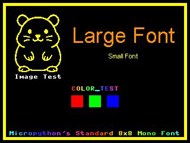

# CYD Nanogui Setup

## Setup

The `/mpy_nanogui` folder contains the complete setup for [Peter Hinch's nanogui](https://github.com/peterhinch/micropython-nano-gui). Only the neccessary display drivers are included.
The screenshot shows how the displayed screen should look after a successfull setup.



1. Upload content of the `/mpy_nanogui` folder (except for the `/font_to_py_multiconverter` folder) to your CYD.
2. Run `main.py`.
3. Edit settings in `color_setup.py` if neccessary. Find the correct settings for `default_mod` and `default_bgr` by trial and error.

**`color_setup.py`**
```python
default_mod = 4 # orientation: 0 - 7
default_bgr = True # rgb / bgr mode
```
