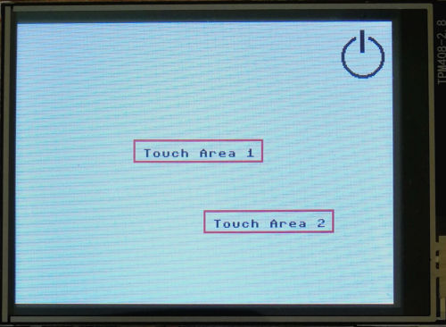

# Micropython Only

## Drivers and Firmware

The standard release of ESP32 MPY-Firmware can be installed on the CYD-2 as described [here](https://github.com/witnessmenow/ESP32-Cheap-Yellow-Display/blob/main/Examples/Micropython/Micropython.md).
The ILI9341 driver and the xpt2046 driver can be found in the `/mpy_only` folder. 

## Color Mode for CYD2

During display initialization in pure Micropython, bgr-mode needs to be disabled:
```python
Display(self.spi_display, dc=Pin(2), cs=Pin(15), rst=Pin(15), width = 320, height = 240, bgr = False)
```

Another solution can be disabling gamma-correction by passing `gamma = False` during Display initialization (see [#2](https://github.com/de-dh/ESP32-Cheap-Yellow-Display-Micropython-LVGL/issues/2#issuecomment-2558521839) )

## Demo program

A working demo and the drivers can be found in the `/mpy_only` folder. 
Draw functions can be used and touch actions can be assigned to multiple areas on screen in the demo program.


