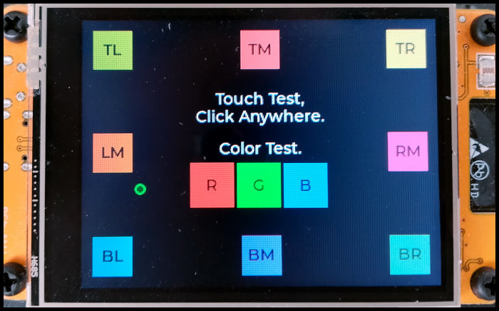

## Cheap Yellow Display and LVGL

The family of Esp32-S2432028Rs or  Cheap Yellow Displays (CYDs) comprises of various boards with similar hardware configuration including

- an Esp32- WROOM
- one or two USB ports
- an ILI9341 2.8' (320 x 240, RGB565) display
- a xpt2046 resistive touch interface
- sdcard adapter, I2S interface, RGB Led and a photoresistor (LDR)
- some GPIO pins / I2C interface

This makes the CYDs ideal candidates for the development of small GUI projects using LVGL and MicroPython.

An integrated Esp32S3 display module with more power is the [JC3248W535 aka Cheap Black Display (CBD)](https://github.com/de-dh/ESP32-JC3248W535-Micropython-LVGL/tree/main).
It has onboard PSRAM which supports more complex LVGL programs.


When it comes to development of GUIs which allow user Input via touch, MPY's primitive draw functions reach their limit pretty fast. It might be possible in theory to make some nice looking GUIs with MPYs primitive draw functions, but the required work would be enormous. This is where LVGL comes into play:

LVGL enables the development of professionally looking GUIs which accept user input with reasonable effort. LVGL offers predefined widgets like labels, buttons, lists, textareas etc. All objects are styled using css-like style properties, e. g. text-color, background-color, shadow, padding. Objects can be aligned relative to each other and complex layouts can be designed using flexbox and grid like positioning. Even animations are supported.

The major drawback of LVGL is that it requires a custom MPY firmware build and setting up the cofiguration for a specific touch / display combination can be tricky. [Kdschlosser's Micropython Bindings](https://github.com/lvgl-micropython/lvgl_micropython) for MPY aims to make the compilation of the firmware as easy as possible. I used this binding to compile the firmware for the CYD which is provided for download in this repositry.

## LVGL8 - Deprecated Documentation and Examples

The old [LVGL8 documentation and examples](LVGL8.md) can be found here.
It is not maintained and the programs are incompatible with LVGL9.

## LVGL9

### Precompiled Firmware

The `/lvgl9_firmware` folder contains a prebuilt firmware for the Cheap Yellow Display (CYD) using LVGL 9.3 and MicroPython 1.25.0. 


The firmware was compiled from commit [15a414b](https://github.com/lvgl-micropython/lvgl_micropython/commit/15a414bc03486017235234882ce7415532c6325e)  from  [Kdschlosser's Micropython Bindings](https://github.com/lvgl-micropython/lvgl_micropython). All drivers for the CYD are included in the firmware, no additional drivers are needed.


The firmware had to be compiled from a previous version of the bindings since the current version has a bug which puts the CYD in a boot loop. 
The firmware includes the touch fix kdschlosser/lvgl_micropython#454 for correct touch calibration.
The previous version of the precompiled firmware required a modified touch driver due to a bug in the calibration routine. This is obsolete now.


The following command is used to flash the firmware (esptool required):

```bash
python -m esptool --chip esp32 --port COMXX -b 460800 --before default_reset --after hard_reset write_flash --flash_mode dio --flash_size 4MB --flash_freq 40m --erase-all 0x0 lvgl_micropython_cyd.bin
```


<details>

<summary>Included LVGL Fonts</summary>


```bash
lv.font_montserrat_10, lv.font_montserrat_12, lv.font_montserrat_14, lv.font_montserrat_16, lv.font_montserrat_24, lv.font_montserrat_32, lv.font_montserrat_40, lv.font_montserrat_48, lv.font_unscii_16, lv.font_unscii_8
```

</details>


### Finding the correct display settings

Although the different versions of CYDs all look alike, they require varying parameters for display and touchscreen initialization.
The file `/lvgl9_firmware/color_test.py` can be used to find the correct display driver's rotation and color settings.
The figure below shows how the program should be displayed (the colors are more intense in reality).
All neccessary settings can be customized at the top of the file. 



```python
# ============== Customize settings ============== #
# The following values need to be customized.

# Switch width and height for portrait mode.
_DISPLAY_WIDTH = const(320)
_DISPLAY_HEIGHT = const(240)
# Try different values from rotation table, see below.
_DISPLAY_ROT = const(0xE0)
# Set to True if red and blue are switched.
_DISPLAY_BGR = const(1)
# May have to be set to 0 if both RGB / BGR mode give bad results.
_DISPLAY_RGB565_BYTE_SWAP = const(1)
# Allow touch calibration. Set to True when display works correctly.
_ALLOW_TOUCH_CAL = const(0)
# Show marker at current touch coordinates.
_DISPLAY_SHOW_TOUCH_INDICATOR = const(1)
```


The following steps have to be followed to correctly set up the CYD for LVGL9. 

A **hard reset is required after every execution of the program** since the hardware might not work correctly otherwise.


1. Depending on the displays orientation the **display's width and height** might need to be edited before running the file. 
For use in landscape mode, `_DISPLAY_WIDTH = 240` and `_DISPLAY_HEIGHT = 320` have to be used. Switch the values for use in portrait mode.
2. Start the program now. If the displayed content is distorted the correct **display rotation** `_DISPLAY_ROT` needs to be found.
The following `MADCTL` values for rotation need to be tested by try and error.

```
# Part from rdagger's micropython ili9341 driver provided under MIT license.
# https://github.com/rdagger/micropython-ili9341/blob/master/ili9341.py

MADCTL_TABLE = {
    (False, 0): 0x80, # mirroring = False
    (False, 90): 0xE0,
    (False, 180): 0x40,
    (False, 270): 0x20,
    (True, 0): 0xC0, # mirroring = True
    (True, 90): 0x60,
    (True, 180): 0x00,
    (True, 270): 0xA0
}
```
3. Next, the correct **colormode** has to be found
E.g. if the red square is rendered in blue then BGR mode must be used by setting `_DISPLAY_BGR = const(1)`. If RGB mode is required set `_DISPLAY_BGR = const(0)`.
4. The last step is the **calibration of the touchscreen**. Set `_ALLOW_TOUCH_CAL = const(1)` and follow the instructions on screen. 
The calibration data is stored in the non volatile storage (NVS) of the Esp32 so calibration has to be performed only once.
The program detects automatically if calibration data is available.


## LVGL Tips

### Examples from the LVGL 8.3 Documentation

The [Documentation for LVGL 8.3](https://docs.lvgl.io/8.3/examples.html) contains Micropython examples for most widgets which are missing in other versions of the documentation.
Most examples can be used with LVGL9 with small modifications.

### LVGL9 Commands

Some commands changed during the upgrade from LVGL8 to LVGL9. E. g., `lv.btn()` becomes `lv.button()`.
The `dir()` method can be used to inspect the attributes of the `lv` class, `lv.obj` class, widget classes etc. to find correct commands.
To inspect the `lv.obj` class and print it's attributes to the shell, the following command can be used:

```python
print(', '.join([m for m in dir(lv.obj) if not m.startswith('__')]))
```

The list can be copied to a text program and commands can be found using search function.

<details>
<summary> 
    Attributes of `lv` 
</summary>

```python
   ['list', 'map', 'pow', 'ALIGN', 'ANIM', 'ANIM_IMAGE_PART', 'ANIM_PLAYTIME_INFINITE', 'ANIM_REPEAT_INFINITE', 'BASE_DIR', 'BLEND_MODE', 'BORDER_SIDE', 'BUTTONMATRIX_BUTTON_NONE', 'CACHE_RESERVE_COND', 'CHART_POINT_NONE', 'COLOR_DEPTH', 'COLOR_FORMAT', 'COORD', 'COVER_RES', 'C_Pointer', 'DIR', 'DISPLAY_RENDER_MODE', 'DISPLAY_ROTATION', 'DPI_DEF', 'DRAW_BUF_ALIGN', 'DRAW_BUF_STRIDE_ALIGN', 'DRAW_SW_MASK_LINE_SIDE', 'DRAW_SW_MASK_RES', 'DRAW_SW_MASK_TYPE', 'DRAW_TASK_STATE', 'DRAW_TASK_TYPE', 'DROPDOWN_POS_LAST', 'EVENT', 'FLEX_ALIGN', 'FLEX_FLOW', 'FONT_FMT_TXT', 'FONT_FMT_TXT_CMAP', 'FONT_GLYPH_FORMAT', 'FONT_KERNING', 'FONT_SUBPX', 'FS_MODE', 'FS_RES', 'FS_SEEK', 'GRAD_DIR', 'GRIDNAV_CTRL', 'GRID_ALIGN', 'GRID_CONTENT', 'GRID_TEMPLATE_LAST', 'GROUP_REFOCUS_POLICY', 'IMAGE_HEADER_MAGIC', 'INDEV_MODE', 'INDEV_STATE', 'INDEV_TYPE', 'KEY', 'LABEL_DOT_NUM', 'LABEL_POS_LAST', 'LABEL_TEXT_SELECTION_OFF', 'LAYER_TYPE', 'LAYOUT', 'LOG_LEVEL', 'LvReferenceError', 'OPA', 'PALETTE', 'PART', 'PART_TEXTAREA', 'RADIUS_CIRCLE', 'RB_COLOR', 'RESULT', 'SCALE_LABEL_ENABLED_DEFAULT', 'SCALE_MAJOR_TICK_EVERY_DEFAULT', 'SCALE_NONE', 'SCALE_TOTAL_TICK_COUNT_DEFAULT', 'SCROLLBAR_MODE', 'SCROLL_SNAP', 'SCR_LOAD_ANIM', 'SIZE_CONTENT', 'SPAN_MODE', 'SPAN_OVERFLOW', 'STATE', 'STRIDE_AUTO', 'STYLE', 'STYLE_RES', 'SUBJECT_TYPE', 'SYMBOL', 'TABLE_CELL_NONE', 'TEXTAREA_CURSOR_LAST', 'TEXT_ALIGN', 'TEXT_DECOR', 'TEXT_FLAG', 'THREAD_PRIO', '_lv_draw_sw_mask_common_dsc_t', '_lv_draw_sw_mask_radius_circle_dsc_t', '_lv_mp_int_wrapper', '_nesting', 'anim_bezier3_para_t', 'anim_count_running', 'anim_delete', 'anim_delete_all', 'anim_get', 'anim_get_timer', 'anim_parameter_t', 'anim_refr_now', 'anim_speed', 'anim_speed_clamped', 'anim_state_t', 'anim_t', 'anim_timeline_create', 'anim_timeline_t', 'animimg', 'animimg_class', 'arc', 'arc_class', 'area_t', 'array_t', 'async_call', 'async_call_cancel', 'atan2', 'bar', 'bar_class', 'barcode', 'barcode_class', 'bezier3', 'bidi_calculate_align', 'bin_decoder_close', 'bin_decoder_get_area', 'bin_decoder_info', 'bin_decoder_init', 'bin_decoder_open', 'binfont_create', 'binfont_destroy', 'bmp_deinit', 'bmp_init', 'button', 'button_class', 'buttonmatrix', 'buttonmatrix_class', 'cache_class_lru_rb_count', 'cache_class_lru_rb_size', 'cache_class_t', 'cache_entry_alloc', 'cache_entry_get_entry', 'cache_entry_get_size', 'cache_entry_t', 'cache_ops_t', 'cache_t', 'calendar', 'calendar_class', 'calendar_date_t', 'calendar_header_arrow', 'calendar_header_arrow_class', 'calendar_header_dropdown', 'calendar_header_dropdown_class', 'canvas', 'canvas_class', 'chart', 'chart_class', 'chart_cursor_t', 'chart_series_t', 'checkbox', 'checkbox_class', 'clamp_height', 'clamp_width', 'color16_t', 'color32_make', 'color32_t', 'color_16_16_mix', 'color_black', 'color_filter_dsc_t', 'color_filter_shade', 'color_format_get_bpp', 'color_format_get_size', 'color_format_has_alpha', 'color_hex', 'color_hex3', 'color_hsv_t', 'color_hsv_to_rgb', 'color_make', 'color_rgb_to_hsv', 'color_t', 'color_white', 'cubic_bezier', 'deinit', 'delay_ms', 'delay_set_cb', 'display_create', 'display_get_default', 'display_t', 'dpx', 'draw_add_task', 'draw_arc', 'draw_arc_dsc_t', 'draw_arc_get_area', 'draw_border_dsc_t', 'draw_box_shadow_dsc_t', 'draw_buf_align', 'draw_buf_create', 'draw_buf_get_handlers', 'draw_buf_handlers_t', 'draw_buf_t', 'draw_buf_width_to_stride', 'draw_character', 'draw_create_unit', 'draw_deinit', 'draw_dispatch', 'draw_dispatch_request', 'draw_dispatch_wait_for_request', 'draw_dsc_base_t', 'draw_fill_dsc_t', 'draw_finalize_task_creation', 'draw_get_next_available_task', 'draw_global_info_t', 'draw_glyph_dsc_t', 'draw_image', 'draw_image_dsc_t', 'draw_image_sup_t', 'draw_init', 'draw_label', 'draw_label_dsc_t', 'draw_label_hint_t', 'draw_layer', 'draw_layer_alloc_buf', 'draw_layer_create', 'draw_layer_go_to_xy', 'draw_line', 'draw_line_dsc_t', 'draw_mask_rect', 'draw_mask_rect_dsc_t', 'draw_rect', 'draw_rect_dsc_t', 'draw_sw_blend_dsc_t', 'draw_sw_deinit', 'draw_sw_init', 'draw_sw_mask_angle_param_cfg_t', 'draw_sw_mask_angle_param_t', 'draw_sw_mask_apply', 'draw_sw_mask_deinit', 'draw_sw_mask_fade_param_cfg_t', 'draw_sw_mask_fade_param_t', 'draw_sw_mask_free_param', 'draw_sw_mask_init', 'draw_sw_mask_line_param_cfg_t', 'draw_sw_mask_line_param_t', 'draw_sw_mask_map_param_cfg_t', 'draw_sw_mask_map_param_t', 'draw_sw_mask_radius_param_cfg_t', 'draw_sw_mask_radius_param_t', 'draw_sw_rgb565_swap', 'draw_sw_rotate', 'draw_task_t', 'draw_triangle', 'draw_triangle_dsc_t', 'draw_unit_t', 'dropdown', 'dropdown_class', 'dropdownlist_class', 'event_dsc_t', 'event_list_t', 'event_register_id', 'event_t', 'flex_init', 'font_default', 'font_glyph_dsc_t', 'font_montserrat_12', 'font_montserrat_14', 'font_montserrat_16', 'font_t', 'free', 'free_core', 'fs_dir_t', 'fs_drv_t', 'fs_file_cache_t', 'fs_file_t', 'fs_get_drv', 'fs_get_ext', 'fs_get_last', 'fs_get_letters', 'fs_is_ready', 'fs_path_ex_t', 'fs_up', 'gd_GCE', 'gd_GIF', 'gd_Palette', 'gd_open_gif_data', 'gd_open_gif_file', 'gif', 'gif_class', 'grad_dsc_t', 'grad_t', 'gradient_stop_t', 'grid_fr', 'grid_init', 'gridnav_add', 'gridnav_remove', 'gridnav_set_focused', 'group_by_index', 'group_create', 'group_focus_obj', 'group_get_count', 'group_get_default', 'group_remove_obj', 'group_swap_obj', 'group_t', 'hit_test_info_t', 'image', 'image_class', 'image_decoder_args_t', 'image_decoder_dsc_t', 'image_decoder_t', 'image_dsc_t', 'image_header_t', 'imagebutton', 'imagebutton_class', 'ime_pinyin', 'ime_pinyin_class', 'imgfont_create', 'imgfont_destroy', 'indev_active', 'indev_create', 'indev_data_t', 'indev_get_active_obj', 'indev_keypad_t', 'indev_pointer_t', 'indev_read_timer_cb', 'indev_search_obj', 'indev_t', 'init', 'is_initialized', 'keyboard', 'keyboard_class', 'label', 'label_class', 'layer_bottom', 'layer_sys', 'layer_t', 'layer_top', 'layout_dsc_t', 'layout_register', 'led', 'led_class', 'line', 'line_class', 'list_button_class', 'list_class', 'list_text_class', 'll_t', 'lodepng_deinit', 'lodepng_init', 'malloc', 'malloc_core', 'malloc_zeroed', 'mem_add_pool', 'mem_deinit', 'mem_init', 'mem_monitor_t', 'mem_remove_pool', 'mem_test', 'mem_test_core', 'memcpy', 'memmove', 'memset', 'memzero', 'menu', 'menu_class', 'menu_cont', 'menu_cont_class', 'menu_main_cont_class', 'menu_main_header_cont_class', 'menu_page', 'menu_page_class', 'menu_section', 'menu_section_class', 'menu_separator', 'menu_separator_class', 'menu_sidebar_cont_class', 'menu_sidebar_header_cont_class', 'mp_lv_init_gc', 'msgbox', 'msgbox_backdrop_class', 'msgbox_class', 'msgbox_content_class', 'msgbox_footer_button_class', 'msgbox_footer_class', 'msgbox_header_button_class', 'msgbox_header_class', 'mutex_delete', 'mutex_init', 'mutex_lock', 'mutex_lock_isr', 'mutex_unlock', 'obj', 'obj_class', 'obj_class_t', 'objid_builtin_destroy', 'observer_t', 'palette_darken', 'palette_lighten', 'palette_main', 'pct', 'pct_to_px', 'pinyin_dict_t', 'point_precise_t', 'point_t', 'qrcode', 'qrcode_class', 'rand', 'rand_set_seed', 'rb_node_t', 'rb_t', 'realloc', 'realloc_core', 'refr_now', 'roller', 'roller_class', 'scale', 'scale_class', 'scale_section_t', 'screen_active', 'screen_load', 'screen_load_anim', 'slider', 'slider_class', 'snapshot_create_draw_buf', 'snapshot_free', 'snapshot_reshape_draw_buf', 'snapshot_take', 'snapshot_take_to_buf', 'snapshot_take_to_draw_buf', 'span_stack_deinit', 'span_stack_init', 'span_t', 'spangroup', 'spangroup_class', 'spinbox', 'spinbox_class', 'spinner', 'spinner_class', 'sqrt', 'sqrt_res_t', 'strcmp', 'strcpy', 'strdup', 'strlen', 'strncpy', 'style_const_prop_id_inv', 'style_get_num_custom_props', 'style_prop_get_default', 'style_prop_has_flag', 'style_register_prop', 'style_t', 'style_transition_dsc_t', 'style_value_t', 'subject_t', 'subject_value_t', 'switch', 'switch_class', 'table', 'table_class', 'tabview', 'tabview_class', 'task_handler', 'text_get_size', 'text_get_width', 'textarea', 'textarea_class', 'theme_apply', 'theme_default_deinit', 'theme_default_get', 'theme_default_init', 'theme_default_is_inited', 'theme_get_color_primary', 'theme_get_color_secondary', 'theme_get_font_large', 'theme_get_font_normal', 'theme_get_font_small', 'theme_get_from_obj', 'theme_simple_deinit', 'theme_simple_get', 'theme_simple_init', 'theme_simple_is_inited', 'theme_t', 'thread_delete', 'thread_init', 'thread_sync_delete', 'thread_sync_init', 'thread_sync_signal', 'thread_sync_wait', 'tick_elaps', 'tick_get', 'tick_inc', 'tick_set_cb', 'tick_state_t', 'tileview', 'tileview_class', 'tileview_tile_class', 'timer_create', 'timer_create_basic', 'timer_enable', 'timer_get_idle', 'timer_get_time_until_next', 'timer_handler', 'timer_handler_run_in_period', 'timer_handler_set_resume_cb', 'timer_periodic_handler', 'timer_state_t', 'timer_t', 'tjpgd_deinit', 'tjpgd_init', 'trigo_cos', 'trigo_sin', 'version_info', 'version_major', 'version_minor', 'version_patch', 'win', 'win_class']
```
</details>


<details>
<summary> 
    Attributes of `lv.obj` 
</summary>

```python
['CLASS_EDITABLE', 'CLASS_GROUP_DEF', 'CLASS_THEME_INHERITABLE', 'FLAG', 'POINT_TRANSFORM_FLAG', 'TREE_WALK', 'add_event_cb', 'add_flag', 'add_state', 'add_style', 'align', 'align_to', 'allocate_spec_attr', 'area_is_visible', 'assign_id', 'bind_flag_if_eq', 'bind_flag_if_not_eq', 'bind_state_if_eq', 'bind_state_if_not_eq', 'calculate_ext_draw_size', 'calculate_style_text_align', 'center', 'check_type', 'class_create_obj', 'class_init_obj', 'clean', 'delete', 'delete_anim_completed_cb', 'delete_async', 'delete_delayed', 'dump_tree', 'enable_style_refresh', 'event_base', 'fade_in', 'fade_out', 'free_id', 'get_child', 'get_child_by_type', 'get_child_count', 'get_child_count_by_type', 'get_class', 'get_click_area', 'get_content_coords', 'get_content_height', 'get_content_width', 'get_coords', 'get_display', 'get_event_count', 'get_event_dsc', 'get_group', 'get_height', 'get_index', 'get_index_by_type', 'get_local_style_prop', 'get_parent', 'get_screen', 'get_scroll_bottom', 'get_scroll_dir', 'get_scroll_end', 'get_scroll_left', 'get_scroll_right', 'get_scroll_snap_x', 'get_scroll_snap_y', 'get_scroll_top', 'get_scroll_x', 'get_scroll_y', 'get_scrollbar_area', 'get_scrollbar_mode', 'get_self_height', 'get_self_width', 'get_sibling', 'get_sibling_by_type', 'get_state', 'get_style_align', 'get_style_anim', 'get_style_anim_duration', 'get_style_arc_color', 'get_style_arc_color_filtered', 'get_style_arc_image_src', 'get_style_arc_opa', 'get_style_arc_rounded', 'get_style_arc_width', 'get_style_base_dir', 'get_style_bg_color', 'get_style_bg_color_filtered', 'get_style_bg_grad', 'get_style_bg_grad_color', 'get_style_bg_grad_color_filtered', 'get_style_bg_grad_dir', 'get_style_bg_grad_opa', 'get_style_bg_grad_stop', 'get_style_bg_image_opa', 'get_style_bg_image_recolor', 'get_style_bg_image_recolor_filtered', 'get_style_bg_image_recolor_opa', 'get_style_bg_image_src', 'get_style_bg_image_tiled', 'get_style_bg_main_opa', 'get_style_bg_main_stop', 'get_style_bg_opa', 'get_style_bitmap_mask_src', 'get_style_blend_mode', 'get_style_border_color', 'get_style_border_color_filtered', 'get_style_border_opa', 'get_style_border_post', 'get_style_border_side', 'get_style_border_width', 'get_style_clip_corner', 'get_style_color_filter_dsc', 'get_style_color_filter_opa', 'get_style_flex_cross_place', 'get_style_flex_flow', 'get_style_flex_grow', 'get_style_flex_main_place', 'get_style_flex_track_place', 'get_style_grid_cell_column_pos', 'get_style_grid_cell_column_span', 'get_style_grid_cell_row_pos', 'get_style_grid_cell_row_span', 'get_style_grid_cell_x_align', 'get_style_grid_cell_y_align', 'get_style_grid_column_align', 'get_style_grid_column_dsc_array', 'get_style_grid_row_align', 'get_style_grid_row_dsc_array', 'get_style_height', 'get_style_image_opa', 'get_style_image_recolor', 'get_style_image_recolor_filtered', 'get_style_image_recolor_opa', 'get_style_layout', 'get_style_length', 'get_style_line_color', 'get_style_line_color_filtered', 'get_style_line_dash_gap', 'get_style_line_dash_width', 'get_style_line_opa', 'get_style_line_rounded', 'get_style_line_width', 'get_style_margin_bottom', 'get_style_margin_left', 'get_style_margin_right', 'get_style_margin_top', 'get_style_max_height', 'get_style_max_width', 'get_style_min_height', 'get_style_min_width', 'get_style_opa', 'get_style_opa_layered', 'get_style_opa_recursive', 'get_style_outline_color', 'get_style_outline_color_filtered', 'get_style_outline_opa', 'get_style_outline_pad', 'get_style_outline_width', 'get_style_pad_bottom', 'get_style_pad_column', 'get_style_pad_left', 'get_style_pad_right', 'get_style_pad_row', 'get_style_pad_top', 'get_style_prop', 'get_style_radius', 'get_style_rotary_sensitivity', 'get_style_shadow_color', 'get_style_shadow_color_filtered', 'get_style_shadow_offset_x', 'get_style_shadow_offset_y', 'get_style_shadow_opa', 'get_style_shadow_spread', 'get_style_shadow_width', 'get_style_space_bottom', 'get_style_space_left', 'get_style_space_right', 'get_style_space_top', 'get_style_text_align', 'get_style_text_color', 'get_style_text_color_filtered', 'get_style_text_decor', 'get_style_text_font', 'get_style_text_letter_space', 'get_style_text_line_space', 'get_style_text_opa', 'get_style_transform_height', 'get_style_transform_pivot_x', 'get_style_transform_pivot_y', 'get_style_transform_rotation', 'get_style_transform_scale_x', 'get_style_transform_scale_x_safe', 'get_style_transform_scale_y', 'get_style_transform_scale_y_safe', 'get_style_transform_skew_x', 'get_style_transform_skew_y', 'get_style_transform_width', 'get_style_transition', 'get_style_translate_x', 'get_style_translate_y', 'get_style_width', 'get_style_x', 'get_style_y', 'get_transformed_area', 'get_user_data', 'get_width', 'get_x', 'get_x2', 'get_x_aligned', 'get_y', 'get_y2', 'get_y_aligned', 'has_class', 'has_flag', 'has_flag_any', 'has_state', 'has_style_prop', 'hit_test', 'init_draw_arc_dsc', 'init_draw_image_dsc', 'init_draw_label_dsc', 'init_draw_line_dsc', 'init_draw_rect_dsc', 'invalidate', 'invalidate_area', 'is_editable', 'is_group_def', 'is_layout_positioned', 'is_scrolling', 'is_valid', 'is_visible', 'mark_layout_as_dirty', 'move_background', 'move_children_by', 'move_foreground', 'move_to', 'move_to_index', 'readjust_scroll', 'redraw', 'refr_pos', 'refr_size', 'refresh_ext_draw_size', 'refresh_self_size', 'refresh_style', 'remove_event', 'remove_event_cb', 'remove_event_cb_with_user_data', 'remove_event_dsc', 'remove_flag', 'remove_local_style_prop', 'remove_state', 'remove_style', 'remove_style_all', 'replace_style', 'report_style_change', 'scroll_by', 'scroll_by_bounded', 'scroll_to', 'scroll_to_view', 'scroll_to_view_recursive', 'scroll_to_x', 'scroll_to_y', 'scrollbar_invalidate', 'send_event', 'set_align', 'set_content_height', 'set_content_width', 'set_ext_click_area', 'set_flex_align', 'set_flex_flow', 'set_flex_grow', 'set_grid_align', 'set_grid_cell', 'set_grid_dsc_array', 'set_height', 'set_layout', 'set_local_style_prop', 'set_parent', 'set_pos', 'set_scroll_dir', 'set_scroll_snap_x', 'set_scroll_snap_y', 'set_scrollbar_mode', 'set_size', 'set_state', 'set_style_align', 'set_style_anim', 'set_style_anim_duration', 'set_style_arc_color', 'set_style_arc_image_src', 'set_style_arc_opa', 'set_style_arc_rounded', 'set_style_arc_width', 'set_style_base_dir', 'set_style_bg_color', 'set_style_bg_grad', 'set_style_bg_grad_color', 'set_style_bg_grad_dir', 'set_style_bg_grad_opa', 'set_style_bg_grad_stop', 'set_style_bg_image_opa', 'set_style_bg_image_recolor', 'set_style_bg_image_recolor_opa', 'set_style_bg_image_src', 'set_style_bg_image_tiled', 'set_style_bg_main_opa', 'set_style_bg_main_stop', 'set_style_bg_opa', 'set_style_bitmap_mask_src', 'set_style_blend_mode', 'set_style_border_color', 'set_style_border_opa', 'set_style_border_post', 'set_style_border_side', 'set_style_border_width', 'set_style_clip_corner', 'set_style_color_filter_dsc', 'set_style_color_filter_opa', 'set_style_flex_cross_place', 'set_style_flex_flow', 'set_style_flex_grow', 'set_style_flex_main_place', 'set_style_flex_track_place', 'set_style_grid_cell_column_pos', 'set_style_grid_cell_column_span', 'set_style_grid_cell_row_pos', 'set_style_grid_cell_row_span', 'set_style_grid_cell_x_align', 'set_style_grid_cell_y_align', 'set_style_grid_column_align', 'set_style_grid_column_dsc_array', 'set_style_grid_row_align', 'set_style_grid_row_dsc_array', 'set_style_height', 'set_style_image_opa', 'set_style_image_recolor', 'set_style_image_recolor_opa', 'set_style_layout', 'set_style_length', 'set_style_line_color', 'set_style_line_dash_gap', 'set_style_line_dash_width', 'set_style_line_opa', 'set_style_line_rounded', 'set_style_line_width', 'set_style_margin_all', 'set_style_margin_bottom', 'set_style_margin_hor', 'set_style_margin_left', 'set_style_margin_right', 'set_style_margin_top', 'set_style_margin_ver', 'set_style_max_height', 'set_style_max_width', 'set_style_min_height', 'set_style_min_width', 'set_style_opa', 'set_style_opa_layered', 'set_style_outline_color', 'set_style_outline_opa', 'set_style_outline_pad', 'set_style_outline_width', 'set_style_pad_all', 'set_style_pad_bottom', 'set_style_pad_column', 'set_style_pad_gap', 'set_style_pad_hor', 'set_style_pad_left', 'set_style_pad_right', 'set_style_pad_row', 'set_style_pad_top', 'set_style_pad_ver', 'set_style_radius', 'set_style_rotary_sensitivity', 'set_style_shadow_color', 'set_style_shadow_offset_x', 'set_style_shadow_offset_y', 'set_style_shadow_opa', 'set_style_shadow_spread', 'set_style_shadow_width', 'set_style_size', 'set_style_text_align', 'set_style_text_color', 'set_style_text_decor', 'set_style_text_font', 'set_style_text_letter_space', 'set_style_text_line_space', 'set_style_text_opa', 'set_style_transform_height', 'set_style_transform_pivot_x', 'set_style_transform_pivot_y', 'set_style_transform_rotation', 'set_style_transform_scale', 'set_style_transform_scale_x', 'set_style_transform_scale_y', 'set_style_transform_skew_x', 'set_style_transform_skew_y', 'set_style_transform_width', 'set_style_transition', 'set_style_translate_x', 'set_style_translate_y', 'set_style_width', 'set_style_x', 'set_style_y', 'set_user_data', 'set_width', 'set_x', 'set_y', 'stringify_id', 'style_get_selector_part', 'style_get_selector_state', 'swap', 'transform_point', 'transform_point_array', 'tree_walk', 'update_flag', 'update_layout', 'update_snap']
```
</details>


### Font Converter for custom fonts

The [font converter](https://lvgl.io/tools/fontconverter) can be used to compile custom fonts for LVGL. 
The image shows the settings used to compile fonts which can be loaded by the following code.

```python
import lvgl as lv
import fs_driver #important

fs_drive_letter = 'S'
fs_font_driver = lv.fs_drv_t()
fs_driver.fs_register(fs_font_driver, fs_drive_letter)

teko_20 = lv.binfont_create(fs_drive_letter + ':' + 'Teko_20.bin')
teko_48 = lv.binfont_create(fs_drive_letter + ':' + 'Teko_48.bin')

label_small.set_style_text_font(teko_36, 0)
label_large.set_style_text_font(teko_48, 0)
```

I have tested several fonts and [Lexend](https://fonts.google.com/specimen/Lexend) is one of my favourites.
It's clearly readable on the CYD with medium or semi-bold font-weight.


### Icon fonts

The `utf8Bytes` function is useful for displaying icons from icon fonts.
It converts the character specific Unicode which is used on font collection websites to a six digit UTF-8 code [required by LVGL](https://docs.lvgl.io/8.3/overview/font.html#add-new-symbols).

```python
def utf8Bytes(hexStr: str):
        ''' Helper function used to display icons.
        Returns the six digit utf8 bytecode from four digit Unicode
        as shown on font collection websites (e.g. font awesome, fontello)
        for direct use in lvgl.
        'F287' -> b'\0xEF\0x8A\0x87'
        
        Use:
        obj.set_style_text_font(icon_font, 0)
        obj.set_text(utf8Bytes('F287'))'''
    
        hexCode = int(hexStr, 16)
        unicodeStr= chr(hexCode)
        utf8Bytecode = unicodeStr.encode('utf-8')
        return utf8Bytecode
```

### Multitasking

@kdschlosser suggests that the `_thread` module should be used to achieve concurrent tasks as described in [this forum post](https://forum.lvgl.io/t/jc3248w535en-event-problem/21586/23).

### Selecting all children of an object

The `obj.get_child()` function returns only direct children (first level) of an object. 
The `get_all_children(obj)` function can be used to get all children of an object.

```python
def get_all_children(parent_obj, exclude_parent = True):
    child_list = []
    
    def walk(child_obj, data = None):
        if child_obj == parent_obj and exclude_parent:
            pass
        else:
            child_list.append(child_obj)
            
        return lv.obj.TREE_WALK.NEXT    
        
    parent_obj.tree_walk(walk, None)
    
    return child_list

# Example use: Return all children of 'obj'
_children = get_all_children(obj)
for el in _children:
    el.add_flag(lv.obj.FLAG.EVENT_BUBBLE)
```


## CYD2 and MicroPython

### Drivers and Firmware

The standard release of ESP32 MPY-Firmware can be installed on the CYD-2 as described [here](https://github.com/witnessmenow/ESP32-Cheap-Yellow-Display/blob/main/Examples/Micropython/Micropython.md).
The ILI9341 driver and the xpt2046 driver can be found in the `/demo_no_lvgl` folder. 

### Color Mode for CYD2

During display initialization in pure Micropython, bgr-mode needs to be disabled:
```python
Display(self.spi_display, dc=Pin(2), cs=Pin(15), rst=Pin(15), width = 320, height = 240, bgr = False)
```

Another solution can be disabling gamma-correction by passing `gamma = False` during Display initialization (see [#2](https://github.com/de-dh/ESP32-Cheap-Yellow-Display-Micropython-LVGL/issues/2#issuecomment-2558521839) )

### Demo program

A working demo and the drivers can be found in the `/demo_no_lvgl` folder. 
Draw functions can be used and touch actions can be assigned to multiple areas on screen in the demo program.


## Links

CYD links:

- [Micropython example for the CYD](https://github.com/witnessmenow/ESP32-Cheap-Yellow-Display/blob/main/Examples/Micropython/Micropython.md): Large repositry about the CYD mainly with `C` examples.
- [Modifiying the CYD's hardware](https://github.com/hexeguitar/ESP32_TFT_PIO): Adding PSRAM, freeing GPIO pins, attaching a speaker.
- [Overview of the different CYD versions](https://github.com/rzeldent/platformio-espressif32-sunton): Overview of different CYD boards and board definitions for PlatformIO.

LVGL / Micropython links:

- [JC3248W535 aka Cheap Black Display (CBD)](https://github.com/de-dh/ESP32-JC3248W535-Micropython-LVGL/tree/main)
- [LVGL](https://github.com/rzeldent/platformio-espressif32-sunton): LVGL main repositry.
- [Micropython](https://github.com/micropython/micropython): Micropython main repositry.
- [LVGL Forum](https://forum.lvgl.io/): You can find help at the LVGL forum. Has a micropython category.
- [Kdschlosser's Micropython Bindings](https://github.com/lvgl-micropython/lvgl_micropython): Micropython bindings from kdschlosser make building the firmware easier and support additional displays.
- [Stefan's Blog](https://stefan.box2code.de/2023/11/18/esp32-grafik-mit-lvgl-und-micropython/): German blog with instructions on how to use LVGL on the CYD. Also contains prebuild firmware for LVGL 8.3.
- [Documentation for LVGL 8.3](https://docs.lvgl.io/8.3/examples.html): Documentation for LVGL 8.3 with Micropython examples.
- [LVGL Font Converter](https://lvgl.io/tools/fontconverter): Online font converter for LVGL.
