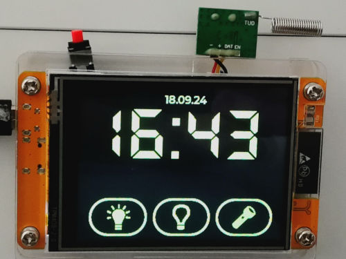
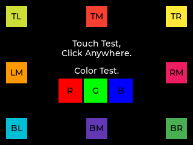

> [!WARNING]
> You must do hard-resets of your CYD after code changes. Soft resets may throw this error: `can't convert to module to int`.
>
> The demos / example programs from the different folders require individual firmwares. They may not be mixed up.
> 
> **>>>>> Please read the complete readme file and check the closed issues before asking for help / opening any new issues. <<<<<**


## Cheap Yellow Display



The family of Esp32-S2432028Rs or Cheap Yellow Displays (CYDs) comprises of various boards with similar hardware configuration most importantly including

- an Esp32- WROOM and
- an ILI9341 2.8' (320 x 240, RGB565) display with a xpt2046 resistive touch interface.

This makes the CYDs ideal candidates for the development of small GUI projects using LVGL and MicroPython.
This repositry documents three different approaches on how to use the CYDs Display and it's touchscreen.

| Approach | Folder | Firmware | Usecase | Description |
| :---: | :---: | :---: | :---: | --- |
| MPY only | [`/mpy_only`](/mpy_only) | Standard MPY Firmware | Very Limited | **Low-level touch** support.<br> Uses rdaggers ILI9431 driver. Only primitive draw functions from MPY's framebuffer module and the display driver available.  |
| MPY + nanogui | [`/mpy_nanogui`](/mpy_nanogui) | Standard MPY Firmware | Simple UI / Data Display | **No touch** support.<br> Supports the creation and updates of simple widgets like Labels and simple diagrams. Custom fonts and mono images can be used easily. Good choice for simple UIs (e. g. displaying data) without touch input. |
| MPY + LVGL | [`/lvgl9_firmwares`](/lvgl9_firmwares) | Precompiled LVGL Firmware | Professional GUIs / User Interactions | **High-level touch** support.<br> Supports professionally looking GUIs with touch user input.<br> _Versions: LVGL 9.4 and Micropython 1.27.0._ |
| - | [`/lvgl9_examples`](/lvgl9_examples) | LVGL Examples | LVGL Examples | Demonstrates various widgets and functionalities of LVGL9 on the CYD.|


The focus of this repositry is the setup of LVGL. LVGL enables the development of professionally looking GUIs which accept user input with reasonable effort. LVGL offers predefined widgets like labels, buttons, lists, textareas etc. All objects are styled using css-like style properties, e. g. text-color, background-color, shadow, padding. Objects can be aligned relative to each other and complex layouts can be designed using flexbox and grid like positioning. Even animations are supported.

The major drawback of LVGL is that it requires a custom MPY firmware build and setting up the cofiguration for a specific touch / display combination can be tricky. [Kdschlosser's Micropython Bindings](https://github.com/lvgl-micropython/lvgl_micropython) for MPY aims to make the compilation of the firmware as easy as possible. The bindings were used to compile the firmware for the CYD which is provided for download in this repositry.

An integrated Esp32S3 display module with more power is the [JC3248W535 aka Cheap Black Display (CBD)](https://github.com/de-dh/ESP32-JC3248W535-Micropython-LVGL/tree/main). It has onboard PSRAM which supports more complex LVGL programs.


## LVGL9 Setup

### Installing the Precompiled Firmwares

The `/lvgl9_firmwares` folder contains  prebuilt firmwares for the Cheap Yellow Display (CYD) using LVGL 9.4 and MicroPython 1.27.0. 

| File Name  | Description |
| ------------- | ------------- |
| _lvgl9_3_micropython_cyd.bin_  | Previous firmware from this repositry compiled from LVGL 9.3 and MPY 1.25. |
| _lvgl_micropy_ESP32_GENERIC-4.bin_  | Current firmware for the CYD with additional font-sizes of the default montserrat font enabled. Use this version or the _default version for the out-of-box CYD.|
| _lvgl_micropy_ESP32_GENERIC-4_default.bin_  | Current firmware for the CYD with only three default font-sizes (12, 14, 16).  |
| _lvgl_micropy_ESP32_GENERIC-SPIRAM-4.bin_  |  Firmware for the CYD with SPIRAM (PSRAM) Mod and various enabled font-sizes. |
| _lvgl_micropy_ESP32_GENERIC-SPIRAM-4_default.bin_  | Firmware for the CYD with PSRAM mod and default font-sizes. |
| _touch_color_test.py_  | This file can be used to find the correct display settings after a LVGL9 firmware was installed. See below. |


The firmware was compiled from  [Kdschlosser's Micropython Bindings](https://github.com/lvgl-micropython/lvgl_micropython). All drivers for the CYD are included in the firmware, no additional drivers are needed.

The following command is used to flash the firmware (esptool required):

```bash
python -m esptool --chip esp32 --port COM10 -b 460800 --before default-reset --after hard-reset write-flash --flash-mode dio --flash-size 4MB --flash-freq 40m --erase-all 0x0 lvgl_micropy_ESP32_GENERIC-4_default.bin
```


### Finding the correct display settings

Although the different versions of CYDs all look alike, they require varying parameters for display and touchscreen initialization.
The file `/lvgl9_firmwares/color_test.py` can be used to find the correct display driver's rotation and color settings.
The figure (screenshot from the CYD) below shows how the program should be displayed.
All neccessary settings can be customized at the top of the file. 



```python
# ============== Customize settings ============== #
# The following values need to be customized.

# Switch width and height for portrait mode.
_DISPLAY_WIDTH = const(320)
_DISPLAY_HEIGHT = const(240)
# Try different values from rotation table, see below.
_DISPLAY_ROT = const(0xE0)
# Set to True if red and blue are switched.
_DISPLAY_BGR = const(1)
# May have to be set to 0 if both RGB / BGR mode give bad results.
_DISPLAY_RGB565_BYTE_SWAP = const(1)
# Allow touch calibration. Set to True when display works correctly.
_ALLOW_TOUCH_CAL = const(0)
# Show marker at current touch coordinates.
_DISPLAY_SHOW_TOUCH_INDICATOR = const(1)
```


The following steps have to be followed to correctly set up the CYD for LVGL9. 

A **hard reset is required after every execution of the program** since the hardware might not work correctly otherwise.


1. Depending on the displays orientation the **display's width and height** might need to be edited before running the file. 
For use in landscape mode, `_DISPLAY_WIDTH = 240` and `_DISPLAY_HEIGHT = 320` have to be used. Switch the values for use in portrait mode.
2. Start the program now. If the displayed content is distorted the correct **display rotation** `_DISPLAY_ROT` needs to be found.
The following `MADCTL` values for rotation need to be tested by try and error.

```
# Part from rdagger's micropython ili9341 driver provided under MIT license.
# https://github.com/rdagger/micropython-ili9341/blob/master/ili9341.py

MADCTL_TABLE = {
    (False, 0): 0x80, # mirroring = False
    (False, 90): 0xE0,
    (False, 180): 0x40,
    (False, 270): 0x20,
    (True, 0): 0xC0, # mirroring = True
    (True, 90): 0x60,
    (True, 180): 0x00,
    (True, 270): 0xA0
}
```
3. Next, the correct **colormode** has to be found
E.g. if the red square is rendered in blue then BGR mode must be used by setting `_DISPLAY_BGR = const(1)`. If RGB mode is required set `_DISPLAY_BGR = const(0)`.
4. The last step is the **calibration of the touchscreen**. Set `_ALLOW_TOUCH_CAL = const(1)` and follow the instructions on screen. 
The calibration data is stored in the non volatile storage (NVS) of the Esp32 so calibration has to be performed only once.
The program detects automatically if calibration data is available.


## Links

CYD links:

- [Micropython example for the CYD](https://github.com/witnessmenow/ESP32-Cheap-Yellow-Display/blob/main/Examples/Micropython/Micropython.md): Large repositry about the CYD mainly with `C` examples.
- [Modifiying the CYD's hardware](https://github.com/hexeguitar/ESP32_TFT_PIO): Adding PSRAM, freeing GPIO pins, attaching a speaker.
- [Overview of the different CYD versions](https://github.com/rzeldent/platformio-espressif32-sunton): Overview of different CYD boards and board definitions for PlatformIO.

LVGL / Micropython links:

- [Kdschlosser's Micropython Bindings](https://github.com/lvgl-micropython/lvgl_micropython): Micropython bindings from kdschlosser make building the firmware easier and support additional displays.
- [baxterbuilds](https://baxterbuilds.com/): Some very useful LVGL9 Micropython examples.
- [JC3248W535 aka Cheap Black Display (CBD)](https://github.com/de-dh/ESP32-JC3248W535-Micropython-LVGL/tree/main)
- [Micropython](https://github.com/micropython/micropython): Micropython main repositry.
- [LVGL Forum](https://forum.lvgl.io/): You can find help at the LVGL forum. Has a micropython category.
- [Stefan's Blog (LVGL8!)](https://stefan.box2code.de/2023/11/18/esp32-grafik-mit-lvgl-und-micropython/): German blog with instructions on how to use LVGL on the CYD. Also contains prebuild firmware for LVGL 8.3.
- [Documentation for LVGL 8.3](https://docs.lvgl.io/8.3/examples.html): Documentation for LVGL 8.3 with Micropython examples.
- [LVGL Font Converter](https://lvgl.io/tools/fontconverter): Online font converter for LVGL.
